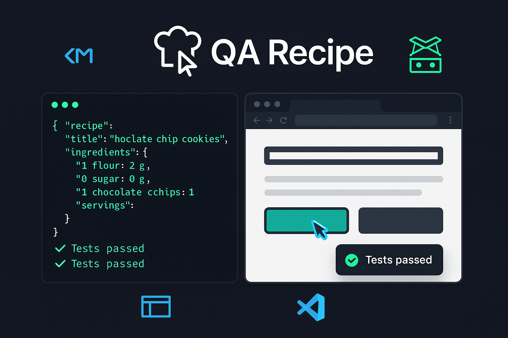

<div align="center">
  
</div>

<div align="center">

# QA Recipe

**Describe browser tests in plain JSON. Run them from your AI agent or the terminal. Let the robot do the clicking.**

[](https://nodejs.org)
[](https://pptr.dev)
[](https://modelcontextprotocol.io)
[](LICENSE)

</div>

---

## What Is This?

QA Recipe is a **zero-config browser automation framework** that turns JSON test recipes into real browser actions — clicks, form fills, assertions, screenshots — powered by [Puppeteer](https://pptr.dev/).

What makes it different: it ships as both a **CLI tool** and an **MCP (Model Context Protocol) server**, so your AI coding assistant (GitHub Copilot, Claude Code) can write *and* run your tests without leaving the chat.

### Key Highlights

- **Recipe-driven** — define browser flows as readable JSON; no code required
- **AI-native** — plug in as an MCP server so Copilot or Claude can create and execute tests on demand
- **Template variables** — `{{randomEmail}}`, `{{randomPassword}}`, `{{timestamp}}` keep every run unique
- **Auto-screenshots** — every step captures a screenshot, timestamped and organised automatically
- **Interactive CLI** — pick a recipe from a menu, or run it directly by name
- **iframe support** — test complex SPAs with nested iframe interactions

---

## Installation

```bash
git clone https://github.com/mariojgt/qa-recipe.git
cd qa-recipe
npm install        # or: bun install
```

Copy `.env.example` to `.env` and adjust if needed:

```bash
cp .env.example .env
```

## Quick Start

### Interactive CLI (recommended)

Pick a recipe from the menu and run it:

```bash
npm run recipe     # or: bun run recipe
```

```
  QA Recipe Runner
  ─────────────────────────────────────

  [1] my-login-test (5 steps)
      Test the login flow end to end

  [2] signup-flow (12 steps)
      Register a new user and verify email

  [0] Exit

  > Select a recipe (1-2):
```

### Run a specific recipe directly

```bash
npm run run -- my-login-test
# or
node src/runner.js my-login-test
```

---

## Using as an MCP Server

QA Recipe exposes browser automation as MCP tools so AI agents can run and manage tests.

### VS Code (GitHub Copilot)

Add to `.vscode/mcp.json` in your workspace:

```json
{
  "servers": {
    "qa-recipe": {
      "type": "stdio",
      "command": "node",
      "args": ["/path/to/qa-recipe/src/mcp-server.js"]
    }
  }
}
```

Then open the Command Palette → **MCP: List Servers** → start `qa-recipe`.

### Claude Code

```bash
claude mcp add qa-recipe node /path/to/qa-recipe/src/mcp-server.js
```

### Available MCP Tools

| Tool | Description |
|------|-------------|
| `qa_execute_steps` | Run test steps in a browser and get pass/fail results |
| `qa_save_recipe` | Save steps as a named recipe for later replay |
| `qa_run_recipe` | Run a saved recipe by name |
| `qa_list_recipes` | List all saved recipes |
| `qa_load_recipe` | View the full details of a saved recipe |
| `qa_delete_recipe` | Delete a saved recipe |

Example prompt in Agent mode:

> Navigate to https://example.com, type "hello" into the search box, click submit, and screenshot the result.

---

## Writing Recipes

Recipes are JSON files stored in `recipes/`. Each recipe defines a sequence of browser actions.

### Recipe file format

```json
{
  "name": "my-test",
  "description": "Describe what this test does",
  "version": 1,
  "config": {
    "headless": true,
    "viewportWidth": 1280,
    "viewportHeight": 800,
    "timeout": 30000
  },
  "steps": [
    { "action": "navigate", "value": "https://example.com", "description": "Open page" },
    { "action": "type", "selector": "#email", "value": "{{randomEmail}}", "description": "Fill email" },
    { "action": "click", "selector": "button[type=submit]", "description": "Submit form" },
    { "action": "screenshot", "description": "Capture result" }
  ]
}
```

Save it to `recipes/my-test.json` and it will appear in the interactive CLI.

### Step Actions

| Action | Required Fields | Description |
|--------|----------------|-------------|
| `navigate` | `value` (URL) | Go to a URL |
| `click` | `selector` | Click an element |
| `type` | `selector`, `value` | Type text into an input |
| `select` | `selector`, `value` | Select a dropdown option |
| `hover` | `selector` | Hover over an element |
| `scroll` | `value` (pixels) | Scroll the page |
| `wait` | `value` (ms) | Wait for a duration |
| `screenshot` | — | Capture a screenshot |
| `assert_url` | `value` | Assert the current URL contains a string |
| `assert_text` | `value` | Assert the page contains text |
| `assert_element` | `selector` | Assert an element exists |
| `type_in_iframe` | `iframeUrlMatch` or `iframeSelector`, `value` | Type into an input inside an iframe |
| `evaluate` | `value` (JS code) | Run arbitrary JavaScript on the page |
| `click_text` | `value` (text) | Click an element containing specific text |

---

## Template Variables

Use `{{variableName}}` placeholders in `value`, `selector`, `iframeInputSelector`, or `iframeUrlMatch` fields. They are resolved to fresh values on every run.

| Variable | Example | Description |
|----------|---------|-------------|
| `{{randomEmail}}` | `qa.tester+1718001234567@test-patchstack.dev` | Unique email |
| `{{randomPassword}}` | `QaT3st!a1b2c3d41718001234567` | Strong password |
| `{{randomPhone}}` | `5551234567` | Phone number |
| `{{randomName}}` | `QA Tester a1b2c3d4` | Full name |
| `{{randomHex}}` | `a1b2c3d4` | 8-char hex string |
| `{{timestamp}}` | `1718001234567` | Unix timestamp (ms) |

---

## All CLI Commands

| Command | Description |
|---------|-------------|
| `npm run recipe` | Interactive recipe picker |
| `npm run run -- <name>` | Run a specific recipe |
| `npm run list` | List all saved recipes (JSON) |
| `npm run execute -- --file steps.json` | Execute steps from a JSON file |
| `npm run save -- <name> --steps '[...]'` | Save a new recipe |
| `npm run mcp` | Start the MCP server |

All commands also work with `bun` (e.g. `bun run recipe`).

---

## License

MIT

---

## Screenshots

Every step captures a screenshot automatically. They are saved to:

```
qaRecipe/screenshots/<recipe-name>/<ISO-timestamp>/
```

---

## Project Structure

```
qaRecipe/
├── package.json
├── recipes/                 # Saved test recipes (JSON)
├── screenshots/             # Test run screenshots
└── src/
    ├── mcp-server.js        # MCP server entry point
    ├── browser.js           # Puppeteer browser automation engine
    ├── execute.js            # Step execution logic
    ├── runner.js             # CLI recipe runner
    ├── recipe.js             # Recipe load/save/list utilities
    ├── save-recipe.js        # CLI recipe saver
    └── variables.js          # Template variable resolution
```
